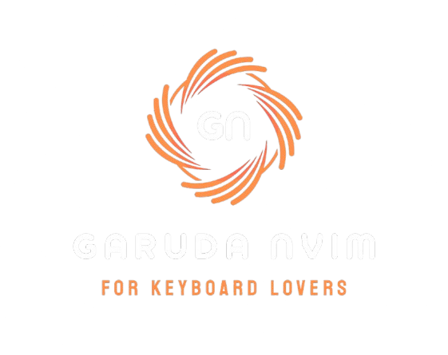

  <h1>Welcome to GarudaNvim</h1>    
  

**GarudaNvim** is a fast and minimal Neovim configuration that empowers you to maximize productivity by utilizing efficient keyboard-based workflows. Inspired by the legendary speed and agility of Garuda, our configuration helps you code faster and navigate seamlessly.

- **Keyboard-Centric**: Everything is optimized to minimize the use of a mouse.
- **Powerful Keymaps**: A thoughtfully crafted keymap system that enhances your productivity.
- **Cross-Platform**: Built for macOS and Linux, GarudaNvim is lightweight yet powerful.

[Get Started](installation.md)

---

## Vision

Our vision for GarudaNvim is to provide a robust, customizable, and easily installable Neovim experience that can rival any modern code editor. Whether you are a seasoned developer or a Neovim enthusiast, GarudaNvim provides the tools and configurations needed for an exceptional coding experience.

---

## Current Version 

**v1.0.0** is the newly released version of GarudaNvim.

🚀 **New Features in v1.0.0**:
- Expanded OS support for Linux and macOS.
- Integration with Lazy plugin manager.
- NvimTree for file navigation.
- New Onedarkpro colorscheme.
